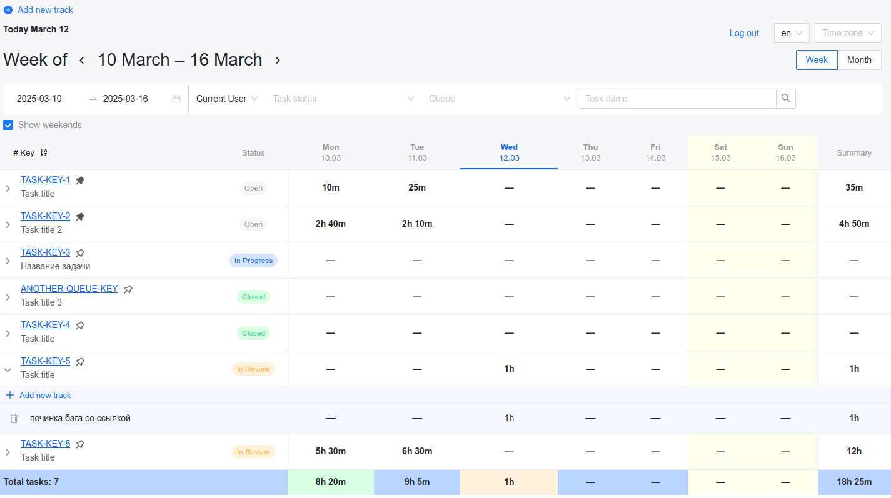
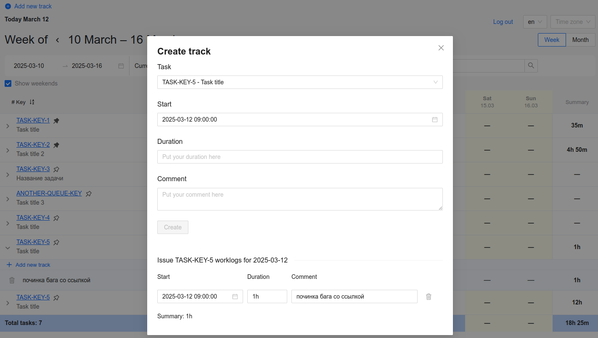
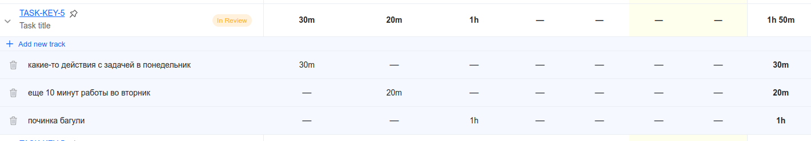
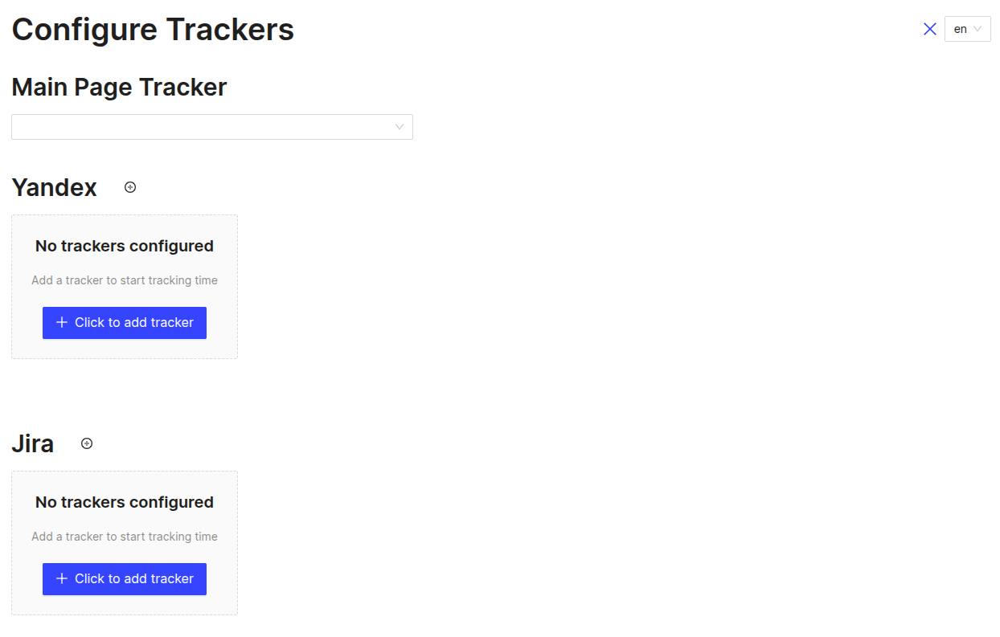
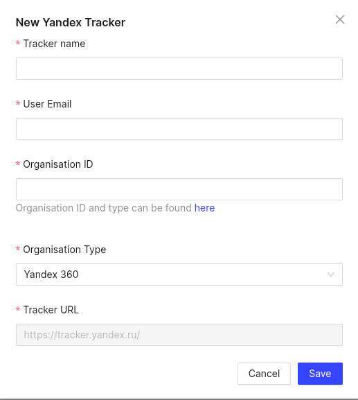

# Yandex Tracker Timesheet
Вы можете ознакомиться с подробной статьёй о Timesheet, перейдя по [ссылке](https://evrone.ru/blog/open-source/timesheet)
- [Основные возможности](#Основные-возможности)
- [Сборка и запуск приложения](#Сборка-и-запуск-приложения)
- [Запуск dev-сервера](#Запуск-dev-сервера)

## Основные возможности
Timesheet возник из необходимости.
Yandex.Tracker отлично справляется с управлением задачами, но его возможности по учёту рабочего времени оставляют желать лучшего.
Разработчикам часто не хватает средства для редактирования записей времени, создания детализированных отчётов и эффективного управления своими рабочими часами.
Timesheet решает эти проблемы, предлагая интуитивно понятный и ориентированный на разработчиков подход.  
Для большего удобства так же была добавлена интеграция с Jira, чтобы иметь возможность переключаться между разными трекерами
в рамках одного сервиса.
Таким образом, можно заносить рабочее время по задачам в едином привычном интерфейсе, а не переключаться между сайтами трекеров и
тратить время на поиск возможности создать/отредактировать время, потраченное на выполнение задачи или формирование отчета, чтобы
проверить корректность введенных изменений за период.

Сервис предоставляет возможность настроить учет рабочего времени в Yandex Tracker, а также интеграцию с Jira и выполнять действия:
  * Просматривать треки по задачам в виде таблицы c суммой треков по всем задачам и по каждой задаче в отдельности.  
По-умолчанию, в список попадают задачи, соответствующие условиям:
  * назначены на текущего пользователя
  * даты создания или обновления задач входят в выбранный диапазон (диапазон отображается в левом верхнем углу под текущей датой)
  * по задаче имеются треки от текущего пользователя, входящие в выбранный диапазон дат
  * закрепленные задачи
  * создавать несколько конфигураций трекеров и переключаться между ними. Это могут быть как разные трекеры: Yandex Tracker, Jira.
Так и несколько конфигураций трекера одного вида, например, если нужно работать с Yandex Tracker разных организаций.

Список задач также можно фильтровать по ответственному, статусам, очереди и названию задачи.
Все опции для фильтров берутся из настроек вашего Yandex Tracker/Jira.

* Закреплять/откреплять задачи по нажатию на значок рядом с ключом.
Закрепленные таким образом задачи будут всегда отображаться в таблице не зависимо от того на кого они назначены и когда были созданы/отредактированы  
Данные о закрепленных задачах хранятся в localstorage, по-этому, не синхронизируются между разными браузерами  



* Создавать треки по задаче. Создание возможно несколькими способами:
  * нажатием на ячейку на пересечении строки задачи с колонкой даты.  
  Если вы ошиблись номером задачи или датой, их можно изменить в появившемся модальном окне
  * нажатием на кнопку `Add new track` в верхнем левом углу страницы.


* Редактировать и удалять треки по задачам. Редактирование возможно 2 способами:
  * нажатием на галочку слева от ключа задачи, разворачиваем список треков. Изменяем текст комментария путем нажатия на текст в строке трека.  
  Время изменяем путем нажатия на внесенное время. Удалить трек можно нажав на иконку корзины слева от комментария к треку
  * нажатием на пересечение строки задачи и столбца даты, вызываем модальное окно создания трека, внизу которого видим  
  все треки внесенные по задаче на выбранную дату. Отсюда можно изменить дату, комментарий и время трека, а также удалить его, нажав на иконку корзины


## Сборка и запуск приложения

Для работы сервиса должна быть установлена [NodeJS](https://www.digitalocean.com/community/tutorials/node-js-ubuntu-18-04-ru#Установка-при-помощи-nvm),
а также указаны переменные окружения из таблицы ниже

| Переменная           | Тип     | Примечание                                                                                                                                                                                                                                                                                      | Обязательно           |
|----------------------|---------|-------------------------------------------------------------------------------------------------------------------------------------------------------------------------------------------------------------------------------------------------------------------------------------------------|-----------------------|
| CLIENT_ID            | string  | Yandex Oauth2 App ID.<br>https://passport.yandex.com/auth?retpath=https%3A%2F%2Foauth.yandex.com%2Fclient%2Fnew&noreturn=1&origin=oauth<br>В настройках необходимо указать:<br>Hostname: https://example.com<br>Redirect URI: https://example.com/token<br>Доступы: tracker:read, tracker:write | Да, для работы с YT   |
| GA_NPM_TOKEN         | string  | GH токен с правами на чтение пакетов можно получить тут (https://github.com/settings/tokens/new) нужно разрешить только  `read:packages`                                                                                                                                                        | Да                    |
| JIRA_CLIENT_SECRET   | string  | Jira OAuth secret. Находится в разделе Settings в странице приложения Atlassian https://developer.atlassian.com/console/myapps/                                                                                                                                                                 | Да, для работы с Jira |
| JIRA_CLIENT_ID       | string  | Jira OAuth App ID. Находится в разделе Settings в странице приложения Atlassian https://developer.atlassian.com/console/myapps/                                                                                                                                                                 | Да, для работы с Jira |

### Команды для сборки и запуска приложения:
- Установка пакетов. 
  ```shell
  npm ci
  ```
  
Если в процессе установки зависимостей, вы видите подобную ошибку 
```
npm error 401 Unauthorized - GET https://npm.pkg.github.com/download/... - unauthenticated: User cannot be authenticated with the token provided.
```
Это означает, что `GA_NPM_TOKEN`, указанный в переменных окружения невалиден. Такое возможно по нескольким причинам:
* токен не указан в переменных
* сгенерирован не тот токен. Нужный токен находится в разделе [`Personal access tokens (classic)`](https://github.com/settings/tokens)
* у токена не установлены полномочия на чтение пакетов (`read:packages`)
* у токена вышел срок действия

- Сборка
  ```shell
  npm run build
  ```
- Запуск
  ```shell
  npm run start
  ```

- Вы также можете запустить приложение в контейнере
  ```shell
  docker build -t timesheet .
  
  # При запуске необходимо передать CLIENT_ID иначе контейнер не запустится
  # Для изменения значения переменной необходимо перезапустить docker run и указать новое значение -e CLIENT_ID=...
  docker run -ti -e CLIENT_ID=XXX -p 3000:3000 timesheet
  ```

### Первый запуск
При первом запуске приложения необходимо ввести настройки хотя бы одного трекера.  
Страница конфигурации будет отличаться в зависимости от настроек переменных окружения.  
Если переменные окружения под какой-то трекер не заданы, секция с настройкой под этот трекер не будет видна в интерфейсе.



### Настройка Yandex Tracker

При настройке Yandex Tracker, вам необходимо будет указать ID организации, который можно найти по [ссылке](https://tracker.yandex.ru/admin/orgs),
там же будет указан тип вашей организации Yandex 360 или Yandex Cloud Organization.  
Далее необходимо указать email который вы используете для входа в Yandex Tracker и задать название трекера (оно может быть любым, главное чтобы не пересекалось с названиями остальных конфигураций, если у вас их несколько)



### Настройка Jira

Для настройки Jira достаточно указать уникальное название, URL вашей Jira и email, используемый для входа в систему.


### Запуск dev-сервера и настройка локальной среды
(доступен по адресу http://localhost:3000/)
  ```shell
    npm run ci
    npm run dev
  ```
При установке пакетов без докера, вам может понадобиться экспортировать переменную `GA_NPM_TOKEN`.  
Например, подобным образом `export GA_NPM_TOKEN=YOUR_TOKEN` (команда может отличаться в разных операционных системах)

Для удобства локальной разработки рекомендуется создать собственное приложение здесь https://oauth.yandex.ru, c доступом к API Яндекс.Трекера.  
При запуске проекта без Docker'а файл `/public/local/api/config.json` не будет перезаписан, поэтому
в нём нужно вручную проставить `client_id`

По аналогии для работы с jira нужно создать приложение по ссылке https://developer.atlassian.com/console/myapps/.  
В Permissions должны быть выданы все разрешения, перечисленные в `config.json` в `jiraAuth.scope`, за исключением `offline_access`.  
А в Authorization должен быть сконфигурирован коллбек `http://localhost:3000/jira-token`
При запуске проекта без Docker'а файл `/public/local/api/config.json` не будет перезаписан, поэтому
в нём нужно вручную проставить `jiraAuth.client_id`

#### Запуск через Docker
  ```shell
    docker-compose up --build
  ```
  ### Возможные проблемы
  
  - В режиме разработки в Google Chrome иногда возникает ошибка `400 Bad Request`, связанная с устаревшими куками. Чтобы её исправить, необходимо очистить куки в настройках браузера.

[](https://evrone.com/?utm_source=github&utm_medium=timesheet)
